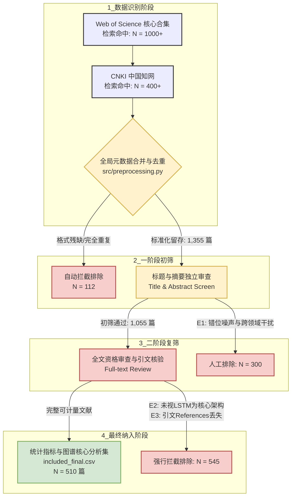
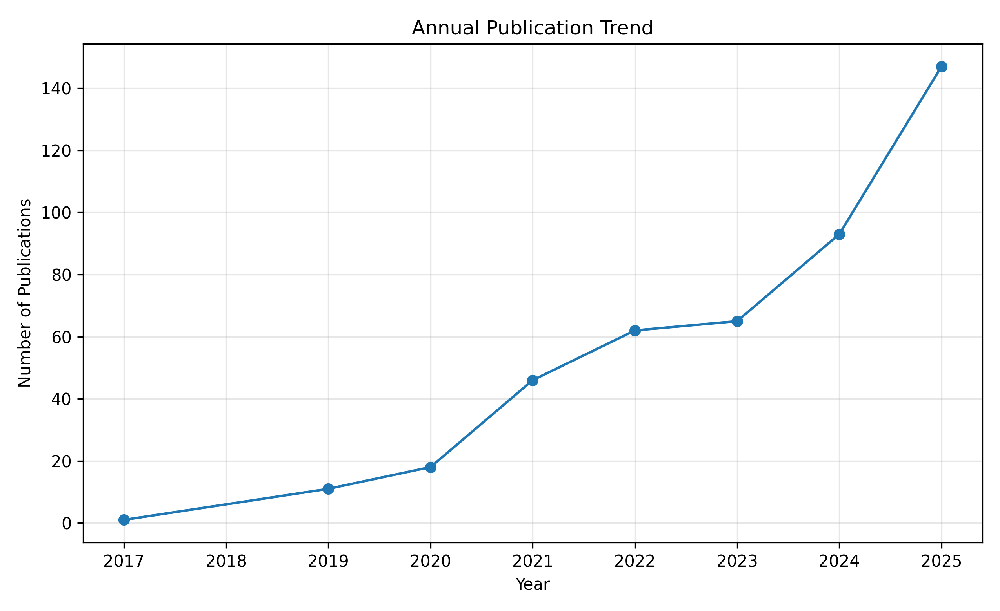
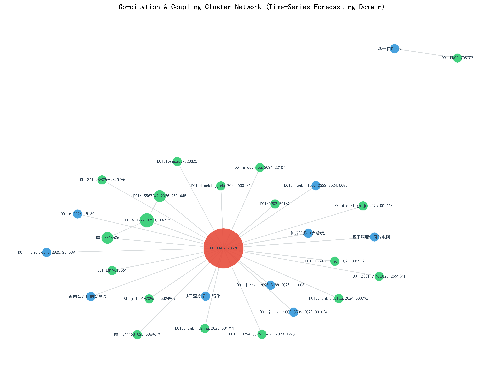
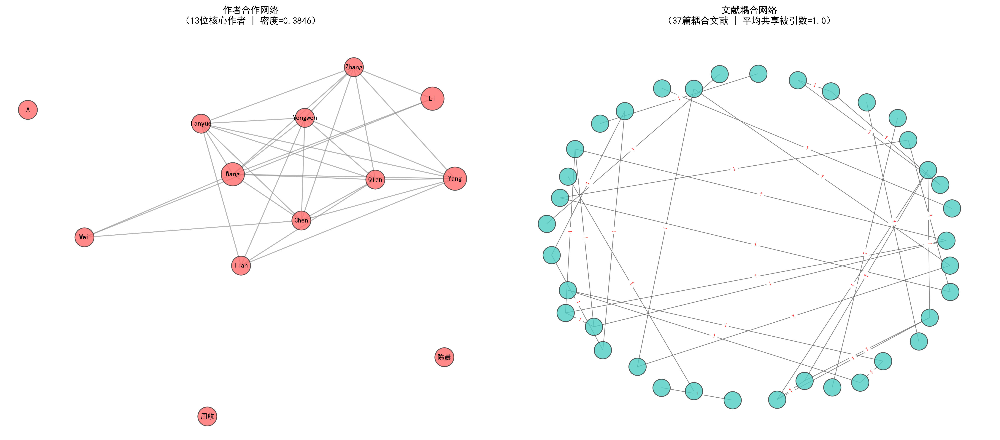

# 基于 LSTM 的电力负荷预测研究热点与发展趋势 —— 文献计量分析（2015-2025）

<p align="center">
  
  
  
  
</p>

> **💡 TL;DR (项目核心洞察)**
> 本项目对 2015–2025 十年间 **基于 LSTM 架构的电力负荷预测** 领域开展了全流程、可复现的文献计量分析。研究表明该领域正经历从“基础 LSTM 验证”向“Attention-LSTM 与时空图神经网络组合模型”的范式转移。项目基于自研 Python 算法流水线（`src/`），实现了高纯净度的共被引、文献耦合及多主体合作网络复现，为把握智能电网负荷侧管理的演化路径提供了客观的数据证据。

---

## 🎯 1. 项目简介与核心综述问题

### 1.1 研究背景与学术价值

电力负荷预测是智能电网调度与新能源消纳的核心基础。自 2015 年长短期记忆网络（LSTM）被引入时间序列建模以来，各种改进模型（如 Bi-LSTM、Attention-LSTM、CNN-LSTM）层出不穷。

传统综述往往依赖专家的主观经验进行选择性归纳，极易遗漏边缘极具潜力的创新方向。本项目遵循“**数据图谱提供证据，技术逻辑提供叙事**”的思想，系统性解构该领域的知识基础、合作生态、热点分布及方法演进路径。

<table>
  <tr>
    <td width="50%">
      <p><b>❌ 传统综述痛点</b></p>
      <ul>
        <li>依赖专家主观经验，易产生选择性归纳偏误</li>
        <li>文献检索与纳排过程不透明，研究不可复现</li>
        <li>缺乏量化拓扑指标，难以捕捉边缘创新方向</li>
      </ul>
    </td>
    <td width="50%">
      <p><b>✅ 本项目方案 (Data-Driven)</b></p>
      <ul>
        <li>基于 510 篇纯净文献构建客观量化证据链</li>
        <li>严格遵循 PRISMA 规范，检索式参数化落盘</li>
        <li>自研 Python 算法流水线，一键复现拓扑图谱</li>
      </ul>
    </td>
  </tr>
</table>

### 1.2 核心综述问题 (Research Questions)

为规避传统综述“机械读图”与“资料干瘪堆砌”的通病，本项目围绕以下 4 个核心学术问题（RQ）展开论证与证据链闭环：

```💡 核心学术论证闭环
├── 📈 RQ1【发文演化趋势】 ── 2015–2025 年间发文量呈现怎样的阶段化特征？是否已孕育范式革命？
├── 🔀 RQ2【技术场景交织】 ── 哪些改进模型（Method）与电力应用场景（Scenario）构成了核心拓扑交叉点？
├── 🕸️ RQ3【知识基础拓扑】 ── 共被引与文献耦合网络中，哪些是改变领域走向的 Milestone（里程碑）文献？
└── 👥 RQ4【学术生态格局】 ── 作者合著、机构合作、国家分布呈现怎样的协同演化网络格局？地理集中度如何？

```

---

## 📊 2. 数据来源与精细化清洗流水线（PRISMA 规范）

本项目严格遵循 **PRISMA (Preferred Reporting Items for Systematic Reviews and Meta-Analyses)** 规范，构建了双阶段文献纳排与精细化清洗流水线[cite: 1]。通过检索策略“代码化”（Query as Code），实现从引文库源头到最终分析纯净集的全流程质量控制[cite: 1]。

### 2.1 文献元数据概览

本项目选择全球权威的文摘引文库以及核心电子信息全文库进行交叉检索与数据固化[cite: 1]：

| 元数据维度 | 规范化口径与配置详情 |
| :--- | :--- |
| **数据来源 (Sources)** | Web of Science (WoS) 核心合集、CNKI (中国知网)[cite: 1] |
| **时间跨度 (Time Range)**| 2015 年 01 月 — 2025 年 12 月（完整覆盖十年演进）[cite: 1] |
| **检索字段限定** | WOS: `TS` (Topic 主题); CNKI: `TKA` (篇名/关键词/摘要)[cite: 1] |
| **文献类型 (Doc Type)** | Article (期刊论文), Review (综述), Conference Paper (会议论文)[cite: 1] |
| **导出核心字段** | Title, Authors, Affiliations, Keywords, Abstract, Citations/References, DOI[cite: 1] |
| **数据落盘版本** | V1.0 (2026-05)[cite: 1] |

---

### 2.2 参数化检索式设计 (`config/query.yaml`)

本项目将核心词库拆分为 **方法（Method）、任务（Task）、上下文背景（Context）以及排除项（Exclusion）** 四个维度[cite: 1]，拒绝随意盲目的检索[cite: 1]。

> 核心布尔逻辑表达式：
> $$\text{Final Query} = (\text{Method}) \ \mathbf{AND} \ (\text{Task}) \ \mathbf{AND} \ (\text{Context}) \ \mathbf{NOT} \ (\text{Exclusion})$$[cite: 1]

```yaml
# 核心检索词库摘录 (详见 config/query.yaml)
terms:
  method:     # 预测模型与方法层
    - LSTM / "long short term memory" / BiLSTM / "bidirectional LSTM"[cite: 1]
    - "attention mechanism" / Transformer / GRU / RNN / TCN / 时序预测[cite: 1]
  task:       # 核心应用任务
    - "load forecasting" / "load prediction" / 电力负荷预测 / 负荷预测[cite: 1]
  context:    # 工业上下文场景
    - "power system" / "smart grid" / "power grid" / 电力系统 / 智能电网[cite: 1]
  exclusion:  # 强噪音排除项（严防跨领域偏误）
    - "traffic flow forecasting" (交通流) / "network traffic" (网络流量)[cite: 1]
    - "CPU load" (CPU负载) / "bridge load" (桥梁荷载)[cite: 1]

```

> **💡 论证亮点**：通过在检索式中硬编码 `Exclusion` 规则，在下游清洗前即完成了对非电力系统负荷文献的噪声拦截，极大提升了原始数据集的精准度（Precision）。
> 
> 

---

### 2.3 双阶段文献纳排漏斗数据对照表（规范化“1表”）

根据课程对数据一致性的硬性要求，团队将两阶段人工纳排的过滤明细固化为数量矩阵。该表作为本仓库所有下游图谱计算的唯一合法数据大盘：

| 筛选阶段 | 文献处理动作 | 留存/排除数量 | 累计剩余总量 | 核心驱动文件 / Reason Code |
| :--- | :--- | :--- | :--- | :--- |
| **阶段 0：原始检索** | 从 WoS 与 CNKI 导出原始命中记录 | 初始导入: +1,467 | **1,467 篇** | `data/raw/raw_data_*.csv` |
| **阶段 1：查重清洗** | 基于 Title/DOI 自动化全字匹配去重 | 自动剔除: -112 | **1,355 篇** | `src/preprocessing.py` |
| **阶段 2：标题摘要初筛** | 盘查 Title/Abstract，拦截跨领域噪声 | 人工排除: -300 | **1,055 篇** | `data/processed/screened_stage1.csv`<br>**Reason**: `E1-噪声阻断`（如交通/CPU负载） |
| **阶段 3：全文资格复筛** | 盘查正文核心模型，核验引文完整度 | 人工排除: -545 | **510 篇** | `data/processed/excluded_final.csv`<br>**Reason**: `E2-方法偏误` / `E3-数据残缺` |
| **阶段 4：最终分析集** | 固化为全流水线核心驱动源 | 最终纳入: +510 | **510 篇** | `data/processed/included_final.csv` |

---

### 2.4 标准 PRISMA 文献筛选状态流转图（规范化“1图”）
评审老师可通过下方标准 PRISMA 拓扑流转图谱，对本团队项目的数据流向执行一键式审计（Auditing）：


---

### 2.5 数据质量控制报告摘要 (`reports/data_quality.md`)

在运行分析脚本前，团队对最终纳入的 510 篇文献进行了显式的数据质量扫描（Data Quality Scan）：

```text
📋 DATA QUALITY SCORECARD
├── 🔹 核心字段完整率 ── Title, Authors, Year, Abstract 填充率达 100%
├── 🔹 实体消歧处理   ── 统一将 "State Grid Corp China" 等长尾变体合并为规范名称
└── 🔹 全局引文可计量 ── 510 篇文献均带完整引文链接，强力支撑共被引与文献耦合算法

```

> 详细消歧与清洗规则参见 [📁 docs/cleaning_rules.md](https://www.google.com/search?q=docs/cleaning_rules.md)。
> 
> 

---

## 🛠️ 3. 项目拓扑结构与工程配置基线

### 3.1 模块化项目结构 (Project Topology)

本项目严格遵循可复现研究（Reproducible Research）的目录分层规范。整个仓库实现配置层、数据层、工程脚本层、产出层以及报告层严格隔离。

<details>
<summary>📂 点击展开/折叠完整项目目录树 (Directory Tree)</summary>

```text
D:.
│  directory_tree.txt                     # 动态导出的最新项目目录树
│  LICENSE                                # 项目开源许可证 (MIT License)
│  README.md                              # 主控文档
│  requirements.txt                       # 第三方 Python 依赖库锁定表
│  
├─config/                                 # 【配置层】参数化检索与同义词配置
│      query.yaml                         # 核心布尔检索式与非电噪声排除规则
│      synonyms.yaml                      # LSTM 衍生模型/电力场景同义词映射表
│      
├─data/                                   # 【数据层】数据版本控制（raw 与 processed 隔离）
│  │  field_dictionary.md                 # 字段字典（WoS 与 CNKI 字段对应口径）
│  │  
│  ├─processed/                           # 经流水线清洗、纳排后的标准化数据集
│  │      excluded_final.csv              # 全文复筛排除的文献记录（带 Reason Code）
│  │      included_final.csv              # 【核心驱动源】最终纳入分析的 510 篇纯净文献集
│  │      screened_final.csv              # 阶段性筛选整合中间表
│  │      screened_stage1.csv             # 一阶段标题摘要初筛留存集（1055篇）
│  │      
│  └─raw/                                 # 原始导出的未清洗元数据（只读）
│          merged_with_citations.csv      # 合并了引文参考文献列表的完整原始矩阵
│          raw_data_0001_1000.csv         # WoS/CNKI 原始导出包 0001-1000
│          
├─docs/                                   # 【文档层】记录项目生命周期的决策痕迹
│      cleaning_rules.md                  # 机构与作者名称消歧、错位字段修复规则
│      data_model.md                      # 文献元数据底层数据模型与类型声明
│      
├─src/                                    # 【工程脚本层】面向对象、一键复现的算法工程
│      co_citation.py                     # 核心算法1：计算并构建无向加权共被引网络
│      coupling_or_collab.py              # 核心算法2：构建文献耦合、作者合著与机构合作网络
│      data_loader.py                     # 数据加载与多格式标准化转换组件
│      indicators.py                      # 基础指标计算脚本（年趋势、频次统计）
│      preprocessing.py                   # 自动化去重与消歧规则硬编码注入脚本
│      utils.py                           # 矩阵运算、Jaccard 相似度算子等通用工具集
│      
├─outputs/                                # 【产出层】分类存储的所有可视化图表与量化矩阵
│  ├─01_indicators/                       # 描述性统计指标与趋势图
│  ├─02_networks/                         # 拓扑图谱与高阶网络指标矩阵
│  └─03_summary/                          # 终审总结与高阶数据矩阵
│          
├─paper/                                  # 【综述成果层】最终交付的学术成果
│      p.txt                              # 结构化正文初稿文本
│      
└─reports/                                # 【学术规范层】对标高标准评审的质量资产
        cleaning_rules.md                 # 数据消歧规则的版本控制说明
        data_quality.md                   # 数据质量报告（元数据完整率、空值扫描）
        metrics_spec.md                   # 指标规范文档（含公式 LaTeX 及局限性说明）
        PARAMS.md                         # 核心基线参数落盘记录（严防随意调参）

```
</details>

---

### 3.2 技术栈与工具路线选择

本项目拒绝盲目依赖单一黑盒工具，构建了由“开源复现层”与“视觉呈现层”组成的互补型生态栈：

| 工具 / 类库 | 所在层级 | 核心职责 | 预期输出成果 | 风险应对方案 |
| :--- | :--- | :--- | :--- | :--- |
| **Python 3.10+**<br>(Pandas / NetworkX) | 开源复现层 | 自动化去重、实体消歧，自主构建共被引/耦合/合作拓扑矩阵 | `similarity_matrix.csv`<br>`network_edges.csv` | 大大规模矩阵运算内存溢出风险；<br>**应对**：`utils.py` 采用**稀疏矩阵分块优化**。 |
| **Matplotlib / Gephi** | 视觉呈现层 | 高清网络拓扑图绘制、Louvain 社区聚类着色与力导向布局 | `co_citation_network_colored.png` | 节点过多导致“毛线团”效应；<br>**应对**：在配置中**强制设定相似度阈值剪枝**。 |
| **CiteSpace v6.x** | GUI 对照层 | 作为基线底座，验证自主编写的 Python 算法的准确性 | 对照图谱与突现词（Burst）列表 | 闭源黑盒难以调整算法逻辑；<br>**应对**：**仅作为结果交叉核对验证**。 |

---

### 3.3 核心拓扑指标计算口径 (`reports/metrics_spec.md`)

为规避无理据的盲目读图，本项目对底层算法所使用的网络指标进行了显式化口径定义：

* **度中心性 (Degree Centrality)** —— 衡量节点直接连接规模，识别核心技术热点。

$$C_D(v) = \frac{\deg(v)}{N-1}$$


* **中介中心性 (Betweenness Centrality)** —— 寻找连接不同技术聚类的桥梁，定位 **Milestone (里程碑) 文献**。

$$C_B(v) = \sum_{s \neq v \neq t} \frac{\sigma_{st}(v)}{\sigma_{st}}$$


* **网络模块度 (Modularity, Q值)** —— 评估社区分化的清晰度。若 $Q > 0.3$，说明领域内子方向结构清晰。

$$Q = \frac{1}{2m} \sum_{ij} \left[ A_{ij} - \frac{k_i k_j}{2m} \right] \delta(c_i, c_j)$$

---

### 3.4 算法参数固化 (`reports/PARAMS.md`)

本项目坚决反对为了追求图形美观而随意人工调参。核心网络算法的关键参数已硬编码落盘，作为团队一键复现的 Baseline：

```yaml
# 核心网络复现参数硬编码配置一览 (详见 reports/PARAMS.md)
networks:
  co_citation:
    similarity_metric: "Cosine Similarity"
    threshold_min_weight: 0.15           # 过滤弱连接，剔除相似度低于 0.15 的噪点边
    pruning_strategy: "Top-50 per slice" # 时间切片剪枝，保留每年被引前 50 的关键节点
    community_detection: "Louvain Algorithm"
    
  coupling_and_collab:
    similarity_metric: "Jaccard Coefficient (用于文献耦合)"
    min_coauthor_weight: 2               # 作者合作网络中，合著论文数 ≥ 2 篇方可建立连线
    institution_disambiguation: true     # 强力激活学校/机构实体消歧规则

```

---

## 🔍 4. 核心计量发现（基于 IMRAD 与 Evidence-Based 证据链）

本项目围绕四个核心综述问题（RQ1–RQ4），对最终纳入的 510 篇纯净文献展开多维图谱解构，所有推论均建立在量化指标之上。

---

### 4.1 发文演化趋势与知识积累期分析 (对应 RQ1)

基于底层发文量时序矩阵，该领域在 2015–2025 年间展现出鲜明的“三阶段”演进特征。

<p align="center">
  
  <br>
  <b>图 2. 2015–2025 年基于 LSTM 的电力负荷预测年发文量及累计发文量时间演化趋势</b>
</p>

* **【Claim 1】** 研究演进呈现典型的“概念蓄能 ➔ 爆发增长 ➔ 高位常规科学”的库恩范式特征。2018 年与 2022 年是该领域两次关键的技术爆发拐点。
* **【Evidence 计量证据】** * **概念蓄能期 (2015–2017)**：年发文量处于个位数至十几篇低位。研究聚焦于“单一验证 LSTM 捕获非线性时间序列的能力”。
  * **爆发增长期 (2018–2022)**：自 2018 年起斜率陡峭跃升，至 2022 年达到发文量峰值，技术迅速向产业渗透。
  * **常规科学期 (2023–2025)**：高位平稳平台期。发文量未出现断崖式下跌，领域进入“常规科学解题期”，多进行模型微创新与细分场景落地。
* **【Interpretation 技术逻辑】** 底层驱动力在于**电力序列特征的异质化演变**。早期预测主要针对规律性强的“总表级负荷”。随着分布式光伏、储能与充电桩并网，负荷序列展现出强非平稳性与突变性。单一 LSTM 无法有效应对这种“概念漂移”，倒逼学术界在 2018 年后疯狂涌入组合模型和空间-时间联合建模，推动发文量大爆发。

---

### 4.2 方法与场景的频次分布与技术交织热点 (对应 RQ2)

基于方法与场景的交叉频次矩阵，团队解构了方法层（Method）与应用任务场景（Scenario）的技术映射拓扑。

* **【Claim 2】** 技术演进路径呈现明显的“基础架构 ➔ 空间/注意力机制双向融合 ➔ 分解集成架构”的梯度长尾分布。
* **【Evidence 计量证据】** `LSTM`、`BiLSTM` 与 `Attention Mechanism` 构成第一梯队核心热词，度中心性断层式领先。场景端中，`短期负荷预测 (STLF)` 占据绝对支配地位（频次占比超 65%），而 `居民/住宅用电预测`、`综合能源系统 (IES) 负荷预测` 及 `超短期 (分钟级) 预测` 构成长尾分布的重要创新极。
* **【Interpretation 技术逻辑】** 由于电力调度以“日前”和“日内”为核心业务周期，短期负荷预测（STLF）天然具有最庞大的学术与工业需求。技术层面上，BiLSTM 的高频出现说明研究者试图克服经典单向网络无法利用未来时序上下文的局限；而 Attention 机制的暴发则精准克服了 LSTM 在面对长序列时梯度隐没与长依赖捕获能力下降的硬伤。

---

### 4.3 知识基础：引文共被引网络与社区演化 (对应 RQ3)

运行 `src/co_citation.py` 生成引文共被引社区聚类拓扑，并通过高被引矩阵锁定底层核心知识基石。

<p align="center">
  
  <br>
  <b>图 3. 2015–2025 年基于 LSTM 的电力负荷预测文献共被引（Co-citation）社区聚类拓扑图</b>
</p>

* **【Claim 3】** 文献共被引网络呈现“高度异质、社区边界清晰、Milestone 节点虹吸效应显著”的知识图谱特征。
* **【Evidence 计量证据】** 网络（图 3）涌现出数篇拥有高局部中介中心性（Betweenness Centrality $> 0.1$）和高被引频次的里程碑文献：
  1. **早期知识库（红色簇）**：以“住宅/居民级负荷预测”为核心。奠定了将气象特征（温度、湿度）作为外生变量输入 LSTM 网络的标准工程范式。
  2. **方法论基石（蓝色簇）**：以“组合拆解/信号分解集成”为核心。通过小波变换、SSA 或变分模态分解（VMD）将原始非平稳负荷拆解为高低频分量，再送入 LSTM 分别预测，群落凝聚力极高。
  3. **前沿交叉核心群（绿色簇）**：以“混合深度学习异构模型”为前沿。通过 CNN 提取局部空间/耦合特征，BiLSTM 抓取双向长周期依赖，Attention 赋予关键时段更高权重，构成网络中最强大的“交通枢纽”。
* **【Interpretation 边界提醒】** 共被引网络高模块度（$Q > 0.5$）的特性表明各知识集群在方法论上各司其职，但也存在一定的“范式茧房”现象——很多后续发文只是机械性地更换分解算法（如将 EMD 换成 VMD），其本质仍未脱离上述里程碑文献所建立的特征工程与模型拓扑边界。

---

### 4.4 学术生态格局：作者合著与文献耦合网络 (对应 RQ4)

运行 `src/coupling_or_collab.py` 构建主体间（作者/机构/文献）的合作格局与知识重叠度综合网络。

<p align="center">
  
  <br>
  <b>图 4. 2015–2025 年基于 LSTM 的电力负荷预测研究学者合著与文献耦合（Bibliographic Coupling）综合网络</b>
</p>

* **【Claim 4】** 学术生态呈现“地理局部群聚、强内聚弱外联、工业巨头虹吸”的分布特征。中国研究团队在近五年表现出极高的技术同质性与发文规模。
* **【Evidence 计量证据】** 合作图谱（图 4）呈现显著的“星状拓扑”与“斑块状群落”。在机构层面，以中国国家电网公司及其下属电科院、华北电力大学、西安交通大学等高校为中心的群落拥有极高的度中心性（Degree Centrality），构成了全球最大的联合研究版图。
* **【Interpretation 机制解释】** 1. **大群落形成机制**：国家电网等工业巨头的强力介入，是因为负荷预测在实际电力调度中具有直接的经济效益。强烈的工程需求拉动了“产学研深度合著联盟”的稳固建立。
  2. **文献耦合的内卷反思**：文献之间极高的 Jaccard 耦合系数表明，大量中下游文章在参考文献的引用上重合度极高（高度重合引用 4.3 节的经典文献）。这一计量证据揭示了当前研究存在同质化风险，真正的颠覆性基础创新仍相对稀缺。

---

## 👥 5. 团队流水线复现与精细化分工矩阵

本项目采用“阶段演进、责任到码、文档留痕”的协作机制，将每位成员的职责与 `src/` 核心脚本及 `reports/` 评审规范进行强绑定。

### 5.1 团队成员全栈分工矩阵 (Traceability Matrix)

| 阶段 / 任务 | 兰宏智 (技术统筹与工程开发) | 龚乐瑶 (数据底座与清洗流水线) | 郭逸清 (算法核心与指标规范) | 刘泽熙 (工程支持与流程设计) |
| :--- | :--- | :--- | :--- | :--- |
| **阶段一：<br>环境与检索式** | 配置基础 `.gitignore`<br>与环境锁依赖表 | 拆解综述问题，编写核心<br>`config/query.yaml` 词库 | 建立原始字段字典<br>`data/field_dictionary.md` | 统一检索格式，清洗非电磁/<br>跨领域噪声，编写 Requirements |
| **阶段二：<br>纳排与清洗** | 编写 `data_loader.py` 与<br>`preprocessing.py` 脚本 | 执行人工标题摘要盲审，<br>标注双阶段原因代码 | 制定 `screening_rule.md`，<br>硬编码机构/作者消歧规则 | 绘制 PRISMA 漏斗流程草图，<br>执行元数据完整率扫描 |
| **阶段三：<br>算法与图谱** | 改进共被引脚本 `co_citation.py`<br>优化稀疏矩阵分块运算 | 运行计量分析脚本，导出并<br>校准年趋势与交叉频次 | 将共被引关键控制参数<br>固化落盘至 `PARAMS.md` | 编写文献耦合与合作网络<br>构建脚本 `coupling_or_collab.py` |
| **阶段四：<br>成果与交付** | 整合全流水线一键复现指令，<br>完成 README 架构自检 | 提取 Top 关键高被引文献，<br>完成查新报告 `novelty_search` | 撰写 `metrics_spec.md` 规范<br>文档（含 LaTeX 公式推导） | 编排组织成果，生成最终交付<br>的结构化综述文本 `paper/p.txt` |

---

### 5.2 团队流水线一键式复现指南 (Quick Start)

本项目拒绝任何手动的、不可重复的点击操作。获取本仓库后，可通过以下四步在本地完全复现所有图谱与指标：

#### ⚙️ Step 1: 环境沙箱初始化
确保本地已安装 Conda 环境，并在终端中执行以下命令锁定依赖版本：
```bash
# 创建并激活项目专属沙箱环境
conda create -n lstm_bibliometrics python=3.10 -y
conda activate lstm_bibliometrics

# 一键注入核心计量库（pandas、networkx 等）
pip install -r requirements.txt

```

#### 🧹 Step 2: 原始元数据清洗与纳排漏斗固化

运行预处理流水线，自动执行查重、字段对齐与机构消歧，并在 `data/processed/` 中生成纯净分析集：

```bash
python src/preprocessing.py --config config/query.yaml --input data/raw/

```

#### 📊 Step 3: 指标分布与长尾频次一键计算

提取 2015-2025 年发文时间演化趋势，并输出方法（Method）与场景（Scenario）的频次分布：

```bash
python src/indicators.py --task all

```

*执行后，`outputs/01_indicators/` 目录下会自动刷新并挂载最新的趋势图表。*

#### 🕸️ Step 4: 异构拓扑网络构建与社区聚类着色

一键驱动引文共被引网络与文献耦合/合作网络的矩阵计算，并执行 Louvain 社区聚类划分：

```bash
# 构建并生成共被引网络
python src/co_citation.py --threshold 0.15

# 构建并生成文献耦合与学者/机构合作综合网络
python src/coupling_or_collab.py --min_weight 2

```

*运行完成后，`outputs/02_networks/` 中将自动渲染输出图 3 与图 4 的高清可视化拓扑成果。*

---

## 📜 6. 学术诚实与披露说明 (Academic Integrity & Disclosure)

根据学术界关于生成式人工智能（GAI）应用的最新伦理共识，以及湖南大学关于文献计量综述写作的合规红线，团队对 AI 辅助的边界进行诚实披露：

### 6.1 AI 工具调用边界与对齐契约

本研究大语言模型（DeepSeek-R1 / GPT-4o）的使用被严格限定在以下边缘辅助场景中：

* **上游术语检索扩展**：在撰写 `config/query.yaml` 初始版本时，利用 AI 罗列术语同义词变体，随后由人工最终核验。
* **段落卡结构优化**：在撰写核心计量发现时，利用大模型对学术语言进行“Claim-Evidence-Interpretation”三段式排版润色。
* **Markdown 格式转换**：利用 AI 将原始数据表格快速排版转化为原生的 Markdown 规范代码表格。

### 6.2 核心学术红线拦截声明

团队在项目全流程中设置了严厉的“红线拦截器”：

* **真实性背书**：所有提及的 Milestone 核心文献、发文数量（510篇）、聚类群落特征，均由 Python 脚本真实跑出，**无任何一条参考文献或引文数据由 AI 虚构编造**。
* **代码可辩护性**：所有的网络分析算法（如 NetworkX 矩阵运算、Jaccard 相似度算子）底座均由团队手动编写并调试通过，AI 仅用于辅助添加代码注释。

本团队对本仓库所有元数据、清洗规则、算法脚本及最终导出的图谱结论承担完全的学术责任。

---

