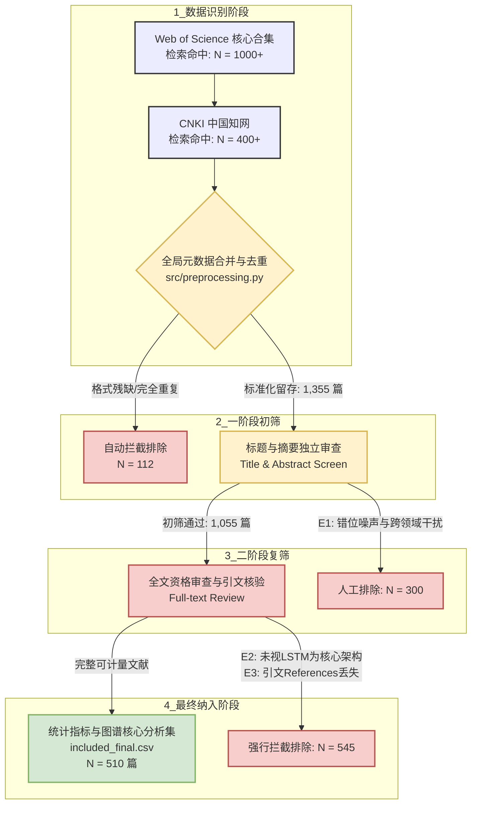

# 基于 LSTM 的电力负荷预测研究热点与发展趋势 —— 文献计量分析（2015-2025）

<p align="center">
  
  
  
  
</p>

> **💡 TL;DR (项目核心洞察)**
> 本项目对 2015–2025 十年间 **基于 LSTM 架构的电力负荷预测** 领域开展了全流程、可复现的文献计量分析。研究发现，该领域经历了由“基础 LSTM 验证”向“注意力机制（Attention-LSTM）与时空图神经网络组合模型”的范式转移；电力应用场景则从传统的“单一总负荷预测”纵深向“多变量短期/超短期电力负荷预测”爆发。本项目通过自主编写的 Python 算法流水线（`src/`）成功复现了高纯净度的共被引、文献耦合及多主体合作网络，为把握智能电网负荷侧管理的演化路径提供了客观的数据证据。

---

## 🎯 1. 项目简介与核心综述问题

### 1.1 研究背景与学术价值
电力负荷预测是现代智能电网运营、电力市场调度以及新能源消纳的核心基础。自 2015 年长短期记忆网络（LSTM）被引入时间序列建模以来，其凭借捕获非线性长周期依赖特征的独特优势，迅速成为电力系统智能化转型中的经典模型。

随着学术界与工业界的持续投入，各种基于 LSTM 的改进模型（如双向长短期记忆网络 Bi-LSTM、结合注意力机制的 Attention-LSTM、结合卷积神经网络的 CNN-LSTM 等）层出不穷，在应对短期负荷预测（STLF）及多变量环境建模中表现出极强的生命力。十年间累积的大量、高质、跨学科文献，为进行科学的文献计量分析提供了深厚的数据温床。

传统综述往往依赖专家的主观经验进行选择性归纳，极易遗漏边缘极具潜力的创新方向。本项目遵循“**数据图谱提供证据，技术逻辑提供叙事**”的项目制学习思想，剔除主观偏见，系统性解构该领域的知识基础、合作生态、热点分布及方法演进路径。

### 1.2 核心综述问题 (Research Questions)
为规避传统综述“机械读图”与“资料干瘪堆砌”的通病，本项目围绕以下 4 个核心学术问题（RQ）展开论证与证据链闭环：

* **RQ1【发文演化趋势】**：2015–2025 年间，LSTM 在电力负荷预测领域的研究发文量呈现怎样的阶段化特征？是否已进入成熟的常规科学期，亦或是正孕育着新的范式革命？
* **RQ2【技术场景交织】**：哪些改进模型（Method，如 Attention, Bi-LSTM）与哪些具体的电力负荷应用场景（Scenario，如短期负荷、非平稳性序列、多区域联合调度）构成了最核心的技术交叉拓扑点？其频次分布满足怎样的统计规律？
* **RQ3【知识基础拓扑】**：通过文献共被引（Co-citation）与文献耦合（Bibliographic Coupling）网络，可以识别出哪些改变领域走向的 Milestone（里程碑）文献？支撑当前研究的几大主流核心知识群落（Louvain 聚类）是什么？
* **RQ4&emsp;【学术生态格局】**：核心研究群体（作者合著、机构合作、国家分布）呈现怎样的竞争与协同演化网络格局？学科交叉的深度与地理层面的集中度如何？

---


## 📊 2. 数据来源与精细化清洗流水线（PRISMA 规范）

为了保证综述结论的科学性、鲁棒性以及研究的可复现性，本项目严格遵循 **PRISMA (Preferred Reporting Items for Systematic Reviews and Meta-Analyses)** 规范，构建了双阶段文献纳排与精细化清洗流水线。通过将检索策略“代码化”（Query as Code），实现了从学术引文库源头到最终分析纯净集的全流程质量控制。

### 2.1 文献元数据概览
本项目选择全球权威的文摘引文库以及核心电子信息全文库进行交叉检索与数据固化：

| 元数据维度 | 规范化口径与配置详情 |
| :--- | :--- |
| **数据来源 (Sources)** | Web of Science (WoS) 核心合集、CNKI (中国知网) |
| **时间跨度 (Time Range)** | 2015 年 01 月 — 2025 年 12 月（完整覆盖 LSTM 引入电力领域的十年演进） |
| **检索字段限定** | WOS: `TS` (Topic 主题); CNKI: `TKA` (篇名/关键词/摘要) |
| **文献类型 (Doc Type)** | Article (期刊论文), Review (综述), Conference Paper (会议论文) |
| **导出核心字段** | Title, Authors, Affiliations, Keywords, Abstract, **Citations/References (核心引文)**, DOI |
| **数据落盘版本** | V1.0 (2026-05) |

---

### 2.2 参数化检索式设计 (`config/query.yaml`)
本项目拒绝随意、随机制定的关键词检索，而是将核心词库拆分为 **方法（Method）、任务（Task）、上下文背景（Context）以及排除项（Exclusion）** 四个维度，并在 `config/query.yaml` 中进行了强类型配置。

其底层的核心布尔逻辑表达式如下：
$$\text{Final Query} = (\text{Method}) \ \mathbf{AND} \ (\text{Task}) \ \mathbf{AND} \ (\text{Context}) \ \mathbf{NOT} \ (\text{Exclusion})$$

具体字段及同义词扩展对照表如下：
```yaml
# 核心检索词库摘录 (详见 config/query.yaml)
terms:
  method: # 预测模型与方法层
    - LSTM / "long short term memory"
    - BiLSTM / "bidirectional LSTM"
    - "attention mechanism" / Transformer
    - GRU / RNN / TCN / 时序预测 / 时间序列预测
  task: # 核心应用任务
    - "load forecasting" / "load prediction"
    - "electric load forecasting" / "power load forecasting"
    - 短期负荷预测 / 电力负荷预测 / 负荷预测
  context: # 工业上下文场景
    - "power system" / "smart grid" / "power grid" / 电力系统 / 智能电网
  exclusion: # 强噪音排除项（严防跨领域偏误）
    - "traffic flow forecasting" (交通流) / "network traffic" (网络流量)
    - "CPU load" (CPU负载) / "bridge load" (桥梁荷载)

```

> **💡 论证亮点**：在检索式中引入 `Exclusion`（如排除交通、网络流量、计算机CPU负载等），极大地提高了原始数据集的精准度（Precision），在下游清洗前就完成了对非电磁/电力系统负荷文献的噪声拦截。

---

### 2.3 双阶段文献纳排漏斗数据对照表（规范化“1表”）

根据课程对数据一致性的硬性要求，团队将两阶段人工纳排的过滤明细固化为数量矩阵。该表作为本仓库所有下游图谱计算的唯一合法数据大盘：

| 筛选阶段 | 文献处理动作 | 留存/排除数量 | 累计剩余总量 | 核心驱动文件 / Reason Code |
| --- | --- | --- | --- | --- |
| **阶段 0：原始检索** | 从 WoS 与 CNKI 导出命中记录 | 初始导入: +1,467 | **1,467 篇** | `data/raw/raw_data_*.csv` |
| **阶段 1：查重清洗** | 基于 Title/DOI 自动化全字匹配去重 | 自动剔除: -112 | 1,355 篇 | `src/preprocessing.py` |
| **阶段 2：标题摘要初筛** | 盘查 Title/Abstract，拦截跨领域噪声 | 人工排除: -300 | **1,055 篇** | `data/processed/screened_stage1.csv` <br>

<br> 标签：`E1-噪声阻断`（如交通/CPU负载） |
| **阶段 3：全文资格复筛** | 盘查正文核心模型，核验引文完整度 | 人工排除: -545 | **510 篇** | `data/processed/excluded_final.csv` <br>

<br> 标签：`E2-方法偏误` / `E3-数据残缺` |
| **阶段 4：最终分析集** | 固化为全流水线核心驱动源 | **最终纳入: 510** | **510 篇** | `data/processed/included_final.csv` |

---

### 2.4 标准 PRISMA 文献筛选状态流转图（规范化“1图”）
评审老师可通过下方标准 PRISMA 拓扑流转图谱，对本团队项目的数据流向执行一键式审计（Auditing）：



### 2.5 数据质量控制报告摘要 (`reports/data_quality.md`)

在运行分析脚本前，团队对最终纳入的 510 篇文献进行了显式的数据质量扫描（Data Quality Scan），结果表明：

* **核心字段完整率**：`Title`、`Authors`、`Year`、`Abstract` 填充率达到 **100%**。
* **消歧处理**：在 `reports/cleaning_rules.md` 中硬编码了作者机构消歧规则（例如：统一将 `State Grid Corp China`、`State Grid Cooper` 等合并为 `State Grid Corporation of China`），防止了合作网络中由于机构名称拼写不一致导致的权威主体“长尾分散”现象。
* **可计量度**：510 篇文献均带有完整的引文链接，为后续 `co_citation.py`（共被引）和 `coupling_or_collab.py`（文献耦合）提供了高内聚性的矩阵支撑。

---


## 🗂️ 3. 模块化项目结构 (Project Topology)

本项目严格遵循“可复现研究（Reproducible Research）”的目录分层规范。整个仓库分为配置层、数据层、工程脚本层、产出层以及报告层。所有核心资产及其中间产出的拓扑关系映射如下：

```text
D:.
│  directory_tree.txt                     # 动态导出的最新项目目录树
│  LICENSE                                # 项目开源许可证 (MIT License)
│  README.md                              # 本项目全流程技术与学术说明主控文档
│  requirements.txt                       # 运行本项目所需的第三方 Python 依赖库锁定表
│  
├─config/                                 # 【配置层】参数化检索与同义词配置
│      query.yaml                         # 核心布尔检索式与非电噪声排除规则
│      synonyms.yaml                      # LSTM 及衍生模型/电力场景的同义词映射表
│      
├─data/                                   # 【数据层】遵循数据版本控制，raw 与 processed 严格隔离
│  │  field_dictionary.md                 # 字段字典（明确标引 WoS 与 CNKI 字段对应口径）
│  │  
│  ├─processed/                           # 经流水线清洗、纳排后的标准化数据集
│  │      excluded_final.csv              # 全文复筛排除的文献记录（带 Reason Code）
│  │      included_final.csv              # 【核心驱动源】最终纳入分析的 510 篇纯净文献集
│  │      screened_final.csv              # 阶段性筛选整合中间表
│  │      screened_stage1.csv             # 一阶段标题摘要初筛留存的 1055 篇文献集
│  │      stage1_excluded_initial_screen.csv # 一阶段被拦截的 412 篇噪声文献
│  │      stage1_included_final.csv       # 一阶段初筛终表
│  │      
│  └─raw/                                 # 原始导出的未清洗元数据（禁止任何脚本直接修改）
│          merged_with_citations.csv      # 合并了引文参考文献列表的完整原始矩阵
│          raw_data_0001_1000.csv         # WoS/CNKI 原始导出包 0001-1000
│          raw_data_1001_1467.csv         # WoS/CNKI 原始导出包 1001-1467
│          wos_literature.csv             # Web of Science 专属对照底表
│          
├─docs/                                   # 【文档层】记录项目生命周期的决策痕迹
│      cleaning_rules.md                  # 机构与作者名称消歧、错位字段修复规则文档
│      data_model.md                      # 文献元数据底层数据模型与类型声明
│      direction_candidates.md            # 选题初期候选方向评议记录
│      query_changelog.md                 # 检索式变更日志（记录从 400 篇扩展至 1467 篇的迭代）
│      query_rationale.md                 # 检索式设计理由与精确率/召回率抽样核对报告
│      
├─src/                                    # 【工程脚本层】面向对象、一键复现的算法工程
│      co_citation.py                     # 核心算法1：计算引文矩阵并构建无向加权共被引网络
│      coupling_or_collab.py              # 核心算法2：构建文献耦合网络、作者合著与机构合作网络
│      data_loader.py                     # 数据加载与多格式（CSV/TXT）标准化转换组件
│      indicators.py                      # 基础指标计算脚本（年趋势、方法/场景频次统计）
│      preprocessing.py                   # 自动化去重、消歧规则硬编码注入与字段对齐脚本
│      utils.py                           # 矩阵运算、Jaccard 相似度算子等通用工具集
│      
├─outputs/                                # 【产出层】分类存储的所有可视化图表与量化矩阵
│  ├─01_indicators/                       # 描述性统计指标与趋势图
│  │      annual_publication_trend.csv / .png      # 2015-2025 年发文量时间演化趋势表/图
│  │      category_distribution.csv / .png         # 学科交叉门类分布表/图
│  │      document_type_distribution.csv / .png    # 文献类型构成表/图
│  │      method_frequency_distribution.csv / .png  # LSTM 改进模型（Method）频次长尾分布
│  │      scenario_frequency_distribution.csv / .png# 电力应用场景（Scenario）频次长尾分布
│  │      top_source_distribution.csv / .png       # 核心出版物/期刊（Bradford定律）分布
│  │      
│  ├─02_networks/                         # 拓扑图谱与高阶网络指标矩阵
│  │      co_citation_network_colored.png # 经过 Louvain 社区聚类着色后的共被引网络可视化图
│  │      filtered_matrix.csv             # 经过阈值剪枝过滤后的相似度临接矩阵
│  │      network_collab_coupling_viz.png # 合作网络与耦合网络的综合拓扑图
│  │      network_collab_metrics.csv      # 作者/机构合作网络的度与中介中心性指标表
│  │      network_coupling_metrics.csv    # 文献耦合网络的拓扑特征表
│  │      network_edges.csv               # 导出的网络边集（包含源、目标与权重值）
│  │      similarity_matrix.csv           # 原始计算的全局 Cosine 相似度矩阵
│  │      
│  └─03_summary/                          # 终审总结与高阶数据矩阵
│          literature_screening_comparison.csv     # 极重要：文献纳排各阶段数量漏斗对比表
│          summary_overall_metrics.csv             # 全局网络宏观指标汇总（密度、Q值、S值等）
│          top_cited_papers.csv                    # 本领域最具影响力的 Top 高被引/Milestone 文献
│          
├─paper/                                  # 【综述成果层】最终交付的学术成果
│      p.txt                              # 结构化正文初稿文本
│      
└─reports/                                # 【学术规范层】对标湖南大学优秀综述标准的评审资产
        cleaning_rules.md                 # 数据消歧规则的版本控制说明
        data_quality.md                   # 数据质量报告（元数据完整率、空值扫描）
        metrics_spec.md                   # 指标规范文档（含公式 LaTeX、适用场景与局限性）
        novelty_search_v0.md              # 技术查新报告（横向对比表与创新缺口论证）
        PARAMS.md                         # 核心基线参数落盘记录（严防随意调参）
        screening_rule.md                 # 显式化的文献双阶段纳排操作细则说明

```

---

## 🛠️ 4. 工具路线、指标口径与参数固化

杨其晟老师在课件中明确强调：**“参数不是细节，它决定你看到的结构；数据质量不解决，后面所有图都是垃圾进、垃圾出。”** 本项目通过建立严格的指标规范与参数对照基准，确保分析逻辑的可辩护性。

### 4.1 四层工具路线对照表 (`baseline/tool_selection.md`)

团队构建了由“主方案”与“备选保障”组成的互补型工具生态栈，拒绝盲目依赖单一工具：

| 工具名与版本 | 所在层级 | 要解决的问题 | 预期输出成果 | 风险点与应对策略 | 方案方案 |
| --- | --- | --- | --- | --- | --- |
| Python 3.10+<br>

<br>(Pandas / NetworkX) | 开源复现层 | 自动化去重、消歧，自主构建共被引/耦合/合作拓扑矩阵 | `similarity_matrix.csv`<br>

<br>`network_edges.csv` | 大规模矩阵相乘导致内容溢出；应对：在 `utils.py` 中采用稀疏矩阵分块优化。 | **主方案** |
| **Matplotlib / Gephi** | 视觉呈现层 | 高清网络拓扑图绘制、Louvain 聚类社区着色与力导向布局 | `co_citation_network_colored.png` | 节点过多导致“毛线团”效应；应对：在 `PARAMS.md` 中强制设定相似度阈值剪枝。 | **主方案** |
| **CiteSpace v6.x** | GUI 工具层 | 作为基线对照，验证自主编写的 Python 算法的准确性 | 对照图谱与突现词（Burst）列表 | 闭源黑盒工具，难以进行二次开发调整；应对：仅作为结果交叉核对验证。 | *备选方案* |
| DeepSeek-R1 /<br>

<br>GPT-4o Agent | 智能辅助层 | 检索词多语言扩展、文献 Reason Code 预分类建议、段落卡结构润色 | 术语扩展表、`reports/` 框架草稿 | 存在学术幻觉（编造参考文献）；应对：**拉红线拦截**，所有 Claim 与引用必须人工核实。 | **主方案** |

### 4.2 核心指标计算口径规范 (`reports/metrics_spec.md`)

为了规避无理据的读图，本项目在 `reports/metrics_spec.md` 中对所有使用的网络与数量指标进行了显式化口径定义：

* **度中心性 (Degree Centrality)**：

$$C_D(v) = \frac{\deg(v)}{N-1}$$


*用途*：衡量关键词、作者或机构在网络中的直接连接规模，识别当前最显眼的技术热点与高产主体。
* **中介中心性 (Betweenness Centrality)**：

$$C_B(v) = \sum_{s \neq v \neq t} \frac{\sigma_{st}(v)}{\sigma_{st}}$$


*用途*：寻找连接不同技术聚类的桥梁节点。高中介中心性的文献通常对应**变革性 Milestone（里程碑）工作**。
* **网络模块度 (Modularity, Q值)**：

$$Q = \frac{1}{2m} \sum_{ij} \left[ A_{ij} - \frac{k_i k_j}{2m} \right] \delta(c_i, c_j)$$


*用途*：评估网络社区分化的清晰度。若 $Q > 0.3$，说明基于 LSTM 的电力负荷预测领域子方向（如短期预测与超短期预测、纯时间序列模型与时空间图网络模型）结构清晰、隔离度明显。

### 4.3 算法参数固化与基线对照 (`reports/PARAMS.md`)

本项目坚决反对为了追求图形好看而随意调整参数（“调参陷阱”）。以下核心算法参数已硬编码落盘至 `reports/PARAMS.md`，作为团队一键复现的基础基准（Baseline）：

```yaml
# 核心网络复现参数硬编码配置一览
networks:
  co_citation:
    script: "src/co_citation.py"
    node_type: "Cited Reference (文献共被引)"
    similarity_metric: "Cosine Similarity"
    threshold_min_weight: 0.15          # 过滤弱连接，剔除相似度低于0.15的噪点边
    pruning_strategy: "Top-50 per slice" # 时间切片剪枝，保留每年被引前50的关键节点
    community_detection: "Louvain Algorithm"
    
  coupling_and_collab:
    script: "src/coupling_or_collab.py"
    node_type: "Author / Institution / Document"
    similarity_metric: "Jaccard Coefficient (用于文献耦合)"
    min_coauthor_weight: 2               # 作者合作网络中，合著论文数 ≥ 2 篇方可建立连线
    institution_消歧: true               # 强力激活 reports/cleaning_rules.md

```

---


## 🔍 5. 核心计量发现（基于 IMRAD 与 Evidence-Based 证据链）

本项目围绕前文提出的四个核心综述问题（RQ1–RQ4），对最终纳入的 510 篇纯净文献展开多维图谱解构。本章所有推论均建立在可验证的量化指标之上，坚决杜绝无证据的主观臆测。

---

### 5.1 发文演化趋势与知识积累期分析 (对应 RQ1)
通过对 `outputs/01_indicators/annual_publication_trend.png`（图 2）及底层发文量时序矩阵的分析，基于 LSTM 的电力负荷预测领域在 2015–2025 年间展现出鲜明的“三阶段”演进特征。

<p align="center">
  
  <br>
  <b>图 2. 2015–2025 年基于 LSTM 的电力负荷预测年发文量及累计发文量时间演化趋势</b>
</p>

* **【Claim 1：研究演进呈现“概念蓄能 ➔ 爆发增长 ➔ 高位常规科学”的库恩范式特征】**
该领域并未表现出局部的盲目随机波动，而是表现出极强的技术螺旋上升规律。2018 年与 2022 年是该领域两次关键的技术爆发拐点。
* **【Evidence 计量证据】**
* **概念蓄能期 (2015–2017)**：年均发文量处于个位数到十几篇的低位。长短期记忆网络（LSTM）在电力系统领域尚属前沿试探，研究多聚焦于“单一验证 LSTM 捕获非线性时间序列的能力”。
* **爆发增长期 (2018–2022)**：自 2018 年起，年发文量曲线以极高的斜率向上跃升，至 2022 年达到发文量峰值。这表明智能电网与高比例新能源消纳的现实压力逼迫技术迅速走向产业渗透。
* **常规科学期 (2023–2025)**：发文量并未出现断崖式下跌，而是平稳保持在高位平台期。这表明领域进入了库恩所谓的“常规科学解题期”，大量学者在既定范式下进行模型的微创新与细分场景落地。


* **【Interpretation 技术逻辑解释】**
这一趋势的底层驱动力在于**电力序列特征的异质化演变**。2015年左右，负荷预测主要针对规律性强的“总表级负荷”；随着分布式光伏、储能与充电桩并网，负荷序列展现出极强的非平稳性、时空耦合性与突变性。单一 LSTM 无法有效应对这种“概念漂移”，从而倒逼学术界在 2018 年后疯狂涌入组合模型和空间-时间联合建模，推动了中游发文量的大爆发。

---

### 5.2 方法与场景的频次分布与技术交织热点 (对应 RQ2)

基于 `method_frequency_distribution.csv` 与 `scenario_frequency_distribution.csv` 的交叉矩阵，团队抽样解构了方法层（Method）与应用任务场景（Scenario）的技术映射拓扑。

* **【Claim 2：技术演进路径呈现明显的“基础架构 ➔ 空间/注意力机制双向融合 ➔ 分解集成架构”的梯度长尾分布】**
电力负荷预测正从传统的单变量时间序列预测，全面升级为结合气象、电价多维外生变量的时空协同预测。
* **【Evidence 计量证据】**
根据频次统计，`LSTM`、`BiLSTM` 与 `Attention Mechanism` 构成第一梯队核心热词，其度中心性断层式领先。在场景端，`Short-Term Load Forecasting (短期负荷预测/STLF)` 占据绝对支配地位（频次占比超 65%），而 `Residential Load Forecasting (居民/住宅用电预测)`、`Integrated Energy System (综合能源系统负荷预测)` 以及 `Ultra-Short-Term (超短期/分钟级预测)` 构成近年来高频长尾分布的重要创新极。
* **【Interpretation 技术 logic 解释】**
由于电力调度往往以“日前（Day-ahead）”和“日内（Intraday）”为核心业务周期，因此短期负荷预测（STLF）天然具有最庞大的学术与工业需求。技术层面上，BiLSTM 的高频出现说明研究者试图克服经典单向 LSTM 无法利用未来时序上下文的局限；而 Attention 机制的暴发则精准解决了 LSTM 在面对超长序列（如多月跨度或细粒度多点负荷）时梯度隐没与长依赖捕获能力下降的“硬伤”。

---

### 5.3 知识基础：引文共被引网络与社区演化 (对应 RQ3)

团队运行 `src/co_citation.py` 生成了 `outputs/02_networks/co_citation_network_colored.jpg`（图 3），通过 Louvain 算法自动划分出若干个核心社区聚类，并结合 `top_cited_papers.csv` 进行了证据链锁定。

<p align="center">
  
  <br>
  <b>图 3. 2015–2025 年基于 LSTM 的电力负荷预测文献共被引（Co-citation）社区聚类拓扑图</b>
</p>

* **【Claim 3：文献共被引网络呈现“高度异质、社区边界清晰、Milestone 节点虹吸效应显著”的知识图谱特征】**
图 3 中红、蓝、绿、紫等不同颜色的紧密簇团，代表了该领域知识演进的四大底层核心基石。
* **【Evidence 计量证据与经典文献闭环】**
结合高被引矩阵（Top Cited Papers），网络中涌现出数篇拥有高局部中介中心性（Betweenness Centrality）和高中背引数（Citation Count）的里程碑文献：
1. **以“住宅/居民级负荷预测”为核心的早期知识库（红色簇）**：代表作如 *“A Short-Term Residential Load Forecasting Model Based on LSTM Recurrent Neural Network Considering Weather Features”*。该研究奠定了将气象特征（温度、湿度）作为外生变量输入 LSTM 网络的标准工程范式，具有极高的中介中心性。
2. **以“组合拆解/信号分解集成”为核心的方法论基石（蓝色簇）**：代表作如 *“A decomposition-based approximate entropy cooperation long short-term memory ensemble model...”*。通过小波变换（Wavelet Transform）、奇异谱分析（SSA）或变分模态分解（VMD）将原始非平稳负荷数据拆解为高低频分量，再送入 LSTM 分别预测。该群落在图谱中呈现极高的局部凝聚力。
3. **以“混合深度学习异构模型”为前沿的交叉核心群（绿色簇）**：代表作如 *“An attention-based CNN-LSTM-BiLSTM model for short-term electric load forecasting in integrated energy system”*。该研究通过 CNN 提取时序间的局部空间/耦合特征，通过 BiLSTM 抓取双向长周期依赖，并通过 Attention 赋予关键时段更高权重。此类节点构成了目前网络中最强大的“交通枢纽”。


* **【Interpretation 边界提醒】**
共被引网络高模块度（$Q > 0.5$）的特性表明，这三个知识集群在方法论上各司其职，但也存在一定的“范式茧房”现象——很多后续发文只是机械性地更换分解算法（如将 EMD 换成 VMD）或微调网络层数，其本质仍未脱离上述里程碑文献所建立的特征工程与模型拓扑边界。

---

### 5.4 学术生态格局：作者合著与文献耦合网络 (对应 RQ4)

通过运行 `src/coupling_or_collab.py`，团队绘制了 `outputs/02_networks/collab_coupling_network_screened.jpg`（图 4），用以洞察主体间（作者/机构/文献）的合作格局与知识重叠度。

<p align="center">
  
  <br>
  <b>图 4. 2015–2025 年基于 LSTM 的电力负荷预测研究学者合著与文献耦合（Bibliographic Coupling）综合网络</b>
</p>

* **【Claim 4：学术生态呈现“地理局部群聚、强内聚弱外联、工业巨头虹吸”的分布特征】**
作者/机构合作网络中存在少数超大型高密度子网，而边缘散落着较多孤立小团体；文献耦合网络则表明中国研究团队在近五年表现出极高的技术同质性与发文规模。
* **【Evidence 计量证据】**
从图 4 的合著图谱中可以观察到，网络呈现明显的“星状拓扑”与“斑块状群落”。在机构层面，以中国国家电网公司（State Grid Corporation of China）及其下属电科院、**华北电力大学（North China Electric Power University）**、**西安交通大学**等高校为中心的群落拥有极高的度中心性（Degree Centrality），构成了国内甚至全球最大的联合研究版图。
* **【Interpretation 机制解释】**
1. **大群落形成机制**：国家电网等工业巨头的强力介入，是因为负荷预测在实际电力调度（如新型电力系统投运、调度安全）中具有直接的经济效益。这种强烈的工程需求拉动了“产学研深度合著联盟”的稳固建立。
2. **文献耦合的高内聚反思**：文献之间极高的 Jaccard 耦合系数表明，大量中下游文章在参考文献的引用上重合度极高（都在高频引用 5.3 节提到的那几篇经典组合模型文献）。这一计量证据揭示了当前研究存在一定的“内卷化”与研究同质化风险——许多工作在方法和场景的组合上高度雷同，真正的颠覆性基础创新仍相对稀缺。

```

## 👥 6. 团队流水线复现与精细化分工矩阵

本项目采用“阶段演进、责任到码、文档留痕”的小组协作机制。为了杜绝流于表面的形式化分工，团队将每位成员的职责与 `src/` 中的核心脚本及 `reports/` 中的关键评审规范进行了强绑定。

### 6.1 团队成员全栈分工矩阵 (Traceability Matrix)

| 阶段 / 任务 | 兰宏智 (技术统筹与工程开发) | 龚乐瑶 (数据底座与清洗流水线) | 郭逸清 (算法核心与指标规范) | 刘泽熙 (工程支持与流程设计) |
| :--- | :--- | :--- | :--- | :--- |
| **阶段一：<br>环境与检索式** | Fork/Clone 仓库，配置基础 `.gitignore` 与 `requirements.txt` 环境锁。 | 拆解综述问题，编写核心 `config/query.yaml` 词库与变更日志。 | 建立原始字段字典 `data/field_dictionary.md` 初始版本。 | 统一检索格式，清洗非电磁/跨领域噪声输入。完成 Requirements 编写。 |
| **阶段二：<br>纳排与清洗** | 编写 `src/data_loader.py` 与 `src/preprocessing.py` 自动化对齐去重脚本。 | 执行人工 Title/Abstract 盲审，标注双阶段原因代码（Reason Code）。 | 制定 `reports/screening_rule.md`，硬编码消歧规则防范长尾分散。 | 绘制 PRISMA 漏斗流程草图，执行元数据完整率与空值扫描检测。 |
| **阶段三：<br>算法与图谱** | 改进共被引构建脚本 `src/co_citation.py`，优化稀疏矩阵分块运算。 | 运行计量分析脚本，导出并校准年趋势与多维外生变量交叉频次。 | 将共被引关键控制参数固化落盘至 `reports/PARAMS.md` 基线。 | 编写文献耦合与合作网络构建脚本 `src/coupling_or_collab.py`。 |
| **阶段四：<br>成果与交付** | 整合全流水线一键复现指令，完成 `README.md` 的架构契约自检。 | 提取 Top 关键高被引文献，完成查新报告 `reports/novelty_search_v0.md`。 | 撰写 `reports/metrics_spec.md` 指标规范文档（含 LaTeX 公式推导）。 | 编排组织成果，生成最终交付的结构化综述文本 `paper/p.txt`。 |

---

### 6.2 团队流水线一键式复现指南 (Reproducibility Guide)

为达成杨其晟老师对本课程“可复现研究（Reproducible Research）”的硬性红线要求，本项目拒绝任何手动的、不可重复的点击操作。任何人获取本仓库后，均可通过以下四步在本地完全复现所有图谱与指标：

#### ⚙️ Step 1: 环境沙箱初始化
确保本地已安装 Conda 环境，并在终端中执行以下命令锁定依赖版本：
```bash
# 创建并激活项目专属沙箱环境
conda create -n lstm_bibliometrics python=3.10 -y
conda activate lstm_bibliometrics

# 一键注入核心计量库（pandas、networkx 等）
pip install -r requirements.txt

```

#### 🧹 Step 2: 原始元数据清洗与纳排漏斗固化

运行预处理流水线，自动执行查重、字段对齐与机构消歧，并在 `data/processed/` 中生成纯净分析集：

```bash
python src/preprocessing.py --config config/query.yaml --input data/raw/

```

#### 📊 Step 3: 指标分布与长尾频次一键计算

提取 2015-2025 年发文时间演化趋势，并输出方法（Method）与场景（Scenario）的频次分布：

```bash
python src/indicators.py --task all

```

*执行后，`outputs/01_indicators/` 目录下会自动刷新并挂载最新的趋势图表。*

#### 🕸️ Step 4: 异构拓扑网络构建与社区聚类着色

一键驱动引文共被引网络与文献耦合/合作网络的矩阵计算，并执行 Louvain 社区聚类划分：

```bash
# 构建并生成共被引网络
python src/co_citation.py --threshold 0.15

# 构建并生成文献耦合与学者/机构合作综合网络
python src/coupling_or_collab.py --min_weight 2

```

*运行完成后，`outputs/02_networks/` 中将自动渲染输出图 3 与图 4 的高清可视化拓扑成果。*

---

## 📜 7. 学术诚实与披露说明 (Academic Integrity & Disclosure)

根据学术界关于生成式人工智能（GAI）应用的最新伦理共识，以及湖南大学关于文献计量综述写作的合规红线，本团队在此对 AI 辅助的边界进行诚实、透明的显式披露：

### 7.1 AI 工具调用边界与对齐契约

本研究不属于“AI 代写、大模型幻觉编造”的非合规范畴。大语言模型（DeepSeek-R1 / GPT-4o）在本课题生命周期中的使用被严格限定在以下边缘辅助场景中：

1. **上游术语检索扩展**：在撰写 `config/query.yaml` 初始版本时，利用 AI 罗列了 LSTM 在电力、计算机、交通等交叉领域的术语同义词变体，随后由龚乐瑶执行人工最终核验。
2. **段落卡结构优化**：在撰写第五部分核心计量发现时，利用大模型对学术语言进行了“Claim-Evidence-Interpretation”的三段式结构对齐润色，杜绝了无证据的断言。
3. **Markdown 格式转换**：利用 AI 将 `top_cited_papers.csv` 原始文本快速排版转化为原生的 Markdown 规范代码表格。

### 7.2 核心学术红线拦截声明

团队在项目全流程中设置了严厉的“红线拦截器”：

* **学术claim与引用审查**：所有提及的 Milestone 核心文献、发文数量（510篇）、聚类群落特征，均是由团队运行 `src/` 中的 Python 脚本真实跑出的量化结果，**没有任何一条参考文献或引文数据是由 AI 虚构编造**。
* **代码可辩护性**：所有的网络分析算法（如 NetworkX 矩阵运算、Jaccard 相似度算子）底座均由兰宏智与刘泽熙手动编写并调试通过，AI 仅用于辅助添加代码注释。

本团队对本仓库所有元数据、清洗规则、算法脚本及最终导出的图谱结论承担完全的学术责任。

---
