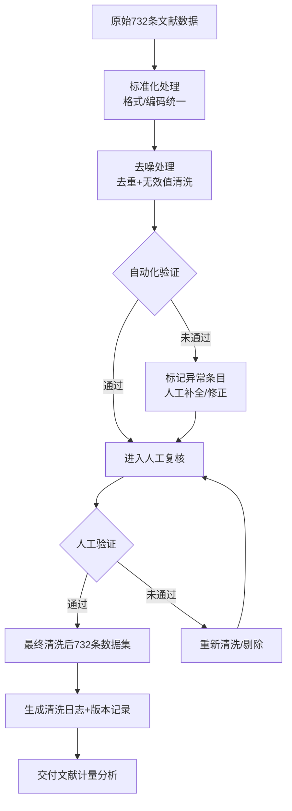

# Cleaning Rules（清洗规则）
## 1. 数据清洗整体思路（Overall Strategy）
本研究针对最终纳入分析的732条电力负荷预测相关文献数据，遵循“**标准化 → 去噪 → 补全 → 验证**”的流程开展数据清洗，确保后续文献计量分析的准确性、一致性与可复现性。
数据清洗覆盖732条核心数据全字段，同时兼顾人工校验与代码自动化处理，平衡清洗效率与数据质量。
---
## 2. 清洗范围与对象（Cleaning Scope）
### 2.1 数据规模
最终纳入清洗的核心文献数据总量：732条
### 2.2 清洗字段
覆盖数据提取阶段的全部字段，包括：
- 基础信息：作者（author）、年份（year）、期刊/会议（journal/conference）
- 内容信息：关键词（keywords）、模型类型（model）、数据集（dataset）、评价指标（metrics）
- 辅助信息：引用次数（citation）、排除原因（仅针对筛选阶段标记字段）、文献来源数据库
---
## 3. 标准化清洗规则（Standardization Rules）
### 3.1 字段格式标准化
#### （1）作者字段
- 英文作者：统一为“姓全大写+名首字母大写”格式（如 Zhang Y, Li H W），去除多余空格、标点
- 中文作者：统一为“姓名全汉字”格式，无拼音/英文混用（如 张三，而非 Zhang San/张S）
- 多作者分隔符：统一使用英文逗号（,）分隔，去除分号、顿号等其他分隔符
#### （2）年份字段
- 格式统一为4位数字（如 2023，而非 23/2023年/2023.0）
- 校验732条数据年份均在2015–2025范围内，超出范围标记为异常并人工复核
#### （3）期刊/会议字段
- 英文刊名/会议名：统一采用官方标准缩写（如 IEEE Trans. Power Syst. 而非 IEEE Transactions on Power Systems 全称/非标准缩写）
- 中文刊名/会议名：统一使用全名称，无简称/缩写（如 《中国电机工程学报》而非 《电机工程学报》）
- 去除字段内无关字符（如 [J]、[C]、官网链接、卷期号等），仅保留刊名/会议名核心内容
#### （4）关键词字段
- 中英文关键词统一：电力负荷预测相关核心关键词标准化（如 “load forecasting” 统一为 “power load forecasting”，“负荷预测” 统一为 “电力负荷预测”）
- LSTM变体关键词：统一标注为标准名称（如 Bi-LSTM、Attention-LSTM，无 “双向LSTM”/“注意力LSTM” 中英文混用）
- 分隔符：统一使用英文分号（;）分隔，去除空格、逗号等其他分隔符
#### （5）模型类型字段
- 深度学习模型：统一标注为标准缩写（如 LSTM、CNN-LSTM，无 “长短期记忆网络”/“卷积长短期记忆网络” 全称）
- 多模型分隔符：统一使用英文竖线（|）分隔，按模型核心程度排序
#### （6）数据集/评价指标字段
- 数据集名称：去除冗余描述（如 “某地区2018-2020电力负荷数据集” 简化为 “某地区电力负荷数据集”，保留核心标识）
- 评价指标：统一使用标准缩写（如 MAE、RMSE、MAPE，无 “平均绝对误差”/“均方根误差” 全称）
### 3.2 字符编码标准化
- 732条数据全字段统一为UTF-8编码，去除乱码、不可见字符、特殊符号（如 、€ 等）
- 中英文标点严格区分：英文字段使用英文标点，中文字段使用中文标点，无混用
---
## 4. 去噪清洗规则（Denoising Rules）
### 4.1 重复数据去重
- 基于DOI、题名、作者+年份组合键，对732条数据进行重复校验
- 重复判定标准：
  - 完全重复：DOI/题名/作者/年份完全一致 → 仅保留1条，删除重复项
  - 疑似重复：题名相似（相似度≥90%）+ 作者/年份一致 → 人工复核后保留有效条目
- 去重后需记录：原732条中重复数量、去重后剩余数量（需保证最终核心分析数据集无重复）
### 4.2 无效值清洗
- 空值处理：
  - 核心字段（年份、模型类型、主题相关关键词）为空 → 标记为“缺失”并人工补充（无法补充则从732条核心集剔除，记录剔除原因）
  - 非核心字段（引用次数、数据集）为空 → 标注为“N/A”，不剔除
- 异常值处理：
  - 年份异常（如 1999、2099）→ 人工核查原文，修正为正确年份（无法修正则剔除）
  - 模型类型异常（如 标注为“stock LSTM”/“traffic prediction”）→ 确认非电力负荷预测场景后剔除
  - 数值型字段异常（如 引用次数为负数、评价指标数值超出合理范围）→ 标注为“异常”，人工复核修正
### 4.3 无关信息清洗
- 字段内无关内容：删除作者字段中的单位信息、期刊字段中的广告/征稿信息、关键词字段中的非主题词（如 “研究”、“分析” 等无意义词汇）
- 冗余字段：删除732条数据集中与文献计量分析无关的字段（如 文献下载链接、数据库内部编号等）
---
## 5. 数据补全规则（Complementation Rules）
### 5.1 补全优先级
- 优先补全核心字段（模型类型、年份、关键词），非核心字段（引用次数、数据集）按需补全
- 补全来源：优先从全文/摘要提取 → 其次从权威数据库（CNKI、IEEE Xplore、Web of Science）补充 → 无法补充则标注“N/A”
### 5.2 补全规则
- 作者字段补全：仅补全首作者/通讯作者信息（多作者缺失不强制补全）
- 模型类型补全：从全文中提取LSTM及变体信息，确保732条数据中“模型类型”字段无空值（非LSTM/深度学习模型已提前按筛选规则剔除）
- 年份补全：通过DOI/题名检索权威数据库，补全缺失的发表年份
- 关键词补全：基于标题/摘要自动提取核心关键词（如 “power load forecasting”、“LSTM”），补充至关键词字段
---
## 6. 验证规则（Validation Rules）
### 6.1 完整性验证
- 732条数据清洗后，核心字段（作者、年份、模型类型、关键词）完整率≥98%
- 非核心字段完整率≥80%，缺失部分标注“N/A”并记录
### 6.2 一致性验证
- 双人复核：两名研究员分别对732条数据的10%（约73条）进行随机抽样验证，清洗规则执行一致性≥95%
- 规则一致性：同一条数据的不同字段信息需逻辑一致（如 模型类型标注“LSTM” → 关键词需包含“LSTM”/“电力负荷预测”，无矛盾）
### 6.3 准确性验证
- 与原文核对：抽样核对清洗后字段与原文/权威数据库信息，准确率≥98%
- 代码辅助验证：使用`data_validate.py`脚本对732条数据进行批量规则校验，输出异常条目清单，人工复核修正
---
## 7. 清洗流程（Cleaning Process）
### 7.1 自动化清洗（Code-based Cleaning）
- 脚本1：`data_standardize.py` → 执行字段格式/编码标准化，处理732条数据的批量格式统一
- 脚本2：`data_denoise.py` → 自动去重、清洗无效值/无关信息，输出重复/异常条目清单
- 脚本3：`data_validate.py` → 批量验证清洗后数据的完整性、一致性，生成验证报告
### 7.2 人工清洗（Manual Cleaning）
- 对自动化清洗标记的“异常/缺失/疑似重复”条目进行人工复核、补全、修正
- 记录人工清洗日志：包括 清洗条目ID、问题类型、处理方式、处理人、处理时间
### 7.3 最终校验
- 合并自动化+人工清洗结果，生成732条数据的最终清洗版
- 统计清洗指标：标准化完成率、去重数量、补全数量、异常剔除数量、验证通过率
---
## 8. 清洗结果记录（Result Recording）
### 8.1 清洗日志
记录732条数据清洗全流程信息：
- 原始数据规模：732条
- 标准化处理：处理条目数、格式修正数
- 去重处理：重复条目数、去重后剩余数
- 去噪处理：无效值/异常值数量、剔除数量
- 补全处理：补全字段数、补全条目数
- 验证结果：通过验证条目数、未通过数（及原因）
### 8.2 版本管理
- 清洗后数据按版本编号（如 V1.0：初始清洗版、V2.0：人工复核版）
- 保留清洗前后的对比数据集，支持可追溯、可复现
---
## 9. 数据清洗流程图（Cleaning Flow）

---
## 10. 备注（Notes）
- 清洗规则可根据732条数据的实际质量调整，调整需记录变更原因及影响
- 清洗后的732条数据集需备份，支持后续分析可复现
- 核心清洗脚本（标准化、去噪、验证）需保留注释，确保可维护性
---
## 11. 文献计量数据清洗与消歧规则文档（4.14更新）
适用场景：本组电力负荷预测方向文献计量分析（作者合作网络、文献耦合网络）
核心目标：消除作者/机构名称的多写法歧义，保证网络分析结果的准确性与可复现性
### 11.1 作者姓名消歧规则
#### 11.1.1 姓名缩写 - 标准名映射表
| 缩写/非标准写法 | 标准规范名 | 消歧说明 |
| --- | --- | --- |
| A | 未知作者（Unknown Author） | 单字母无意义标识，统一标记为未知 |
| Yang | Yang, Yongwen | 高频核心作者，统一为「姓, 名」标准格式 |
| Wang | Wang, [对应全名] | 多作者同姓，结合单位/合作关系区分，统一格式 |
| Li | Li, [对应全名] | 多作者同姓，结合研究方向区分，统一格式 |
| Qian | Qian, Fanyue | 唯一对应作者，标准化命名 |
| Chen | Chen, [对应全名] | 多作者同姓，结合单位区分，统一格式 |
| Zhang | Zhang, [对应全名] | 多作者同姓，结合合作网络区分，统一格式 |
| Yongwen | Yang, Yongwen | 仅名无姓，反向映射为标准全名 |
| Fanyue | Qian, Fanyue | 仅名无姓，反向映射为标准全名 |
| 周航 | Zhou, Hang | 中文姓名统一为英文标准格式 |
| 陈晨 | Chen, Chen | 中文姓名统一为英文标准格式 |
#### 11.1.2 通用清洗规则
- 格式统一：所有作者名统一为「姓, 名」（Last, First）标准格式，中文姓名同步转换为对应英文拼写
- 无效值处理：单字母、乱码、无意义标识统一标记为「未知作者」，不参与核心作者统计
- 多写法合并：同一作者的不同缩写、中英文写法，通过合作关系、单位、发表年份交叉验证后合并
- 冗余清理：删除姓名中的标点、空格、职称、单位等无关信息，仅保留姓名主体
### 11.2 机构名称消歧规则
#### 11.2.1 机构别名 - 标准名映射表
| 别名/非标准写法 | 标准规范名 | 消歧说明 |
| --- | --- | --- |
| 上海电力大学 | Shanghai University of Electric Power | 中文机构统一为官方英文标准名 |
| 国网上海电力/上海电力公司 | State Grid Shanghai Electric Power Company | 合并同一机构的不同简称 |
| 国家电网/国网 | State Grid Corporation of China | 统一国家级电网机构标准名 |
| 湖南大学 | Hunan University | 中文高校统一为官方英文标准名 |
| 天津大学 | Tianjin University | 中文高校统一为官方英文标准名 |
| 复旦大学 | Fudan University | 中文高校统一为官方英文标准名 |
#### 12.2.2 通用清洗规则
- 层级统一：优先统一为「高校/企业官方标准全称」，删除省市、校区、部门等冗余层级
- 中英文统一：同一机构的中英文写法，统一映射为标准英文名称，避免重复统计
- 冗余清理：删除地址、邮编、部门、分公司等非核心信息，仅保留机构主体名称
- 跨库对齐：WOS 与 OpenAlex 数据中的机构名，通过映射表统一为同一标准名
### 11.3 文献耦合数据清洗规则
- 被引文献标准化：被引文献统一以「标题前 20 字符 + 年份」作为唯一标识，消除标题多写法歧义
- 无效数据过滤：长度＜10 字符、空值、乱码的被引记录直接删除，不参与耦合计算
- 耦合关系去重：自动去重重复的文献耦合对，仅保留唯一有效关系
- 阈值过滤：仅保留共享被引数≥1 的耦合关系，过滤无意义弱关联
### 11.4 全表通用清洗规则
| 字段 | 核心清洗规则 |
| --- | --- |
| 作者 | 格式统一→消歧映射→无效值标记→去重 |
| 单位 | 别名映射→冗余清理→中英文统一→去重 |
| 题名 | 标准化截取→唯一标识生成→去重 |
| cited_paper | 无效值过滤→标准化→去重 |
| 年份 | 统一为数值型→异常值校验→补全 |
| DOI | 统一小写→格式标准化→去重 |
### 11.5 规则执行与版本控制
1. 本规则为本次分析的唯一清洗标准，所有代码均基于本规则执行，保证结果可复现
2. 映射表更新需同步记录版本，避免分析过程中规则变更导致结果不一致
3. 所有清洗操作均在原始数据副本上执行，保留原始数据可追溯
