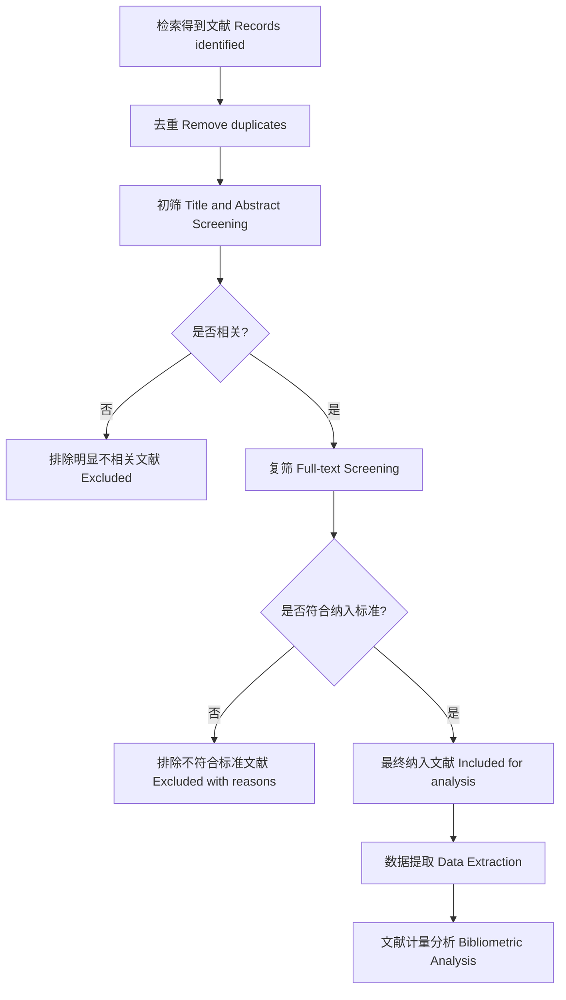

# Screening Rules（筛选规则）
## 1. 研究思路（Overall Strategy）
本研究采用“**检索 → 筛选 → 数据提取 → 文献计量分析**”的流程，对LSTM（Long Short-Term Memory）在电力负荷预测（power load forecasting）中的研究进行系统分析。
筛选部分分为三个层次：
- 初筛（title + abstract）
- 复筛（full text）
- 辅助代码筛选（rule-based filtering）
以保证结果的准确性（precision）与覆盖率（recall）之间的平衡。
---
## 2. 研究主题与范围（Research Scope）
本研究基于文献计量分析（bibliometric analysis），关注：
- LSTM 及其变体（Bi-LSTM、Attention-LSTM 等）
- 深度学习（deep learning）在电力负荷预测中的应用
- 时间范围：2015–2025 年
- 文献类型：期刊（journal）与会议（conference）
- 语言：中文 + 英文
---
## 3. 纳入标准（Inclusion Criteria）
满足以下条件的文献纳入：
### （1）主题相关
- 与电力负荷预测（power load forecasting）相关
- 使用 LSTM 或深度学习方法
- 包含实验或模型验证（experiment / validation）
### （2）时间范围
- 2015–2025 年
### （3）文献类型
- 期刊论文或会议论文
- 相关综述（review）可作为背景参考文献，但原则上不纳入核心计量分析样本
### （4）数据可用性
- 可获取摘要或全文
- 可提取关键字段（作者、关键词等）
---
## 4. 排除标准（Exclusion Criteria）
### （1）主题不相关
- 非电力负荷预测
- 未使用 LSTM / 深度学习
### （2）文献类型
- 专利、书籍、博客、学位论文
- 无完整方法的摘要
### （3）质量问题
- 无实验或验证
- 无法提取字段信息
### （4）时间与语言
- 非中英文
- 不在 2015–2025
---
## 5. 筛选流程（Screening Process）
### 5.1 去重（Deduplication）
- 对来自不同数据库的文献进行合并
- 根据 DOI、题名（title）、作者（author）和年份（year）进行重复文献识别
- 对重复记录仅保留一条，避免同一文献被重复统计
---
### 5.2 初筛（Title & Abstract Screening）
- 基于标题与摘要进行快速筛选
- 标记为：
  - 纳入（include）
  - 排除（exclude）
  - 不确定（uncertain）
- 主要目的：提高筛选效率，快速剔除明显无关文献
---
### 5.3 复筛（Full-text Screening）
- 对“纳入”和“不确定”的文献阅读全文
- 检查：
  - 是否真正使用 LSTM
  - 是否属于负荷预测场景
  - 是否有实验验证
- 主要目的：保证筛选结果准确性
---
### 5.4 代码辅助筛选（Code-based Filtering）
在人工筛选基础上，引入简单规则进行辅助筛选：
- 代码辅助筛选仅作为人工筛选的补充，不直接替代人工判断
- 对代码标记为可疑或边界模糊的文献，仍需人工复核
代码辅助筛选分为三个部分：

#### （1）初筛代码（Stage 1 Screening）
基于题名（title）与摘要（abstract）进行规则匹配，重点检查以下内容：
- 时间范围是否在 2015–2025 年之间
- 是否包含电力负荷预测相关关键词（如 load forecasting, load prediction）
- 是否属于电力系统场景（如 power system, electric）
- 是否使用 LSTM 或深度学习方法
- 是否命中排除关键词（如 stock, traffic 等）
初筛结果分为三类：
- `include`：符合条件，进入下一阶段
- `exclude`：明显不符合条件
- `uncertain`：存在边界情况，需人工复核

对应脚本：`stage1_screen.py`

---
#### （2）复筛代码（Stage 2 Screening）
对初筛后保留的文献进一步结合全文（full text）和语言信息进行复筛，重点检查：
- 文献语言是否为中文或英文
- 是否可获取全文
- 全文中是否真正使用 LSTM 方法
- 是否包含实验、结果或验证内容
复筛结果分为两类：
- `include`：纳入最终分析
- `exclude`：不纳入最终分析，并记录排除原因

对应脚本：`stage2_screen.py`

---
#### （3）PRISMA 统计与可视化
在完成初筛与复筛后，使用代码自动统计各阶段文献数量，并生成 PRISMA 流程统计图，用于展示：
- 检索总量（Identification）
- 初筛后保留数量（Screening）
- 复筛后纳入数量（Eligibility）
- 最终分析文献数量（Included）

对应脚本：`prisma_stats.py`

---
#### （4）说明
代码辅助筛选的主要作用包括：
- 提高筛选一致性（consistency）
- 减少人工重复劳动
- 支持批量处理与可复现分析（reproducible analysis）
- 为后续 PRISMA 流程图和筛选日志提供数据支持
---
## 6. 数据提取（Data Extraction）
提取以下字段：
- 作者（author）
- 年份（year）
- 期刊/会议（journal/conference）
- 关键词（keywords）
- 模型类型（model）
- 数据集（dataset）
- 评价指标（metrics）
- 引用次数（citation）
---
## 7. 质量控制（Quality Control）
- 双人筛选（two reviewers）
- 不一致文献讨论决定
- 保证筛选标准一致（reproducible）
- 记录排除原因（reason for exclusion）
### 7.1 排除原因记录（Reason Codes）
为保证文献筛选过程的**可追溯性（traceability）与一致性（consistency）**，  
本研究采用统一的 Reason Code 编码体系，对被排除文献的原因进行标记。

具体编码如下：

- **E1 - 非本主题（Not relevant）**  
  文献研究内容与电力负荷预测无关，或不属于目标领域
- **E2 - 无全文（No full text）**  
  无法获取全文或仅有标题/摘要，无法进一步判断
- **E3 - 方法不符（Method mismatch）**  
  未使用 LSTM 或深度学习方法，或方法不符合研究范围
- **E4 - 时间不符（Out of range）**  
  发表时间不在 2015–2025 年范围内
- **E5 - 语言不符（Language mismatch）**  
  非中文或英文文献
- **E6 - 质量不符（Low quality）**  
  缺乏实验验证、结果分析或方法描述不完整
---
## 8. 备注（Notes）
- 筛选规则可根据检索结果调整
- 后续分析包括：
  - 关键词共现（co-occurrence）
  - 合作网络（collaboration network）
  - 模型发展趋势（model evolution）
---
## 9. 文献筛选流程图（PRISMA Flow）

